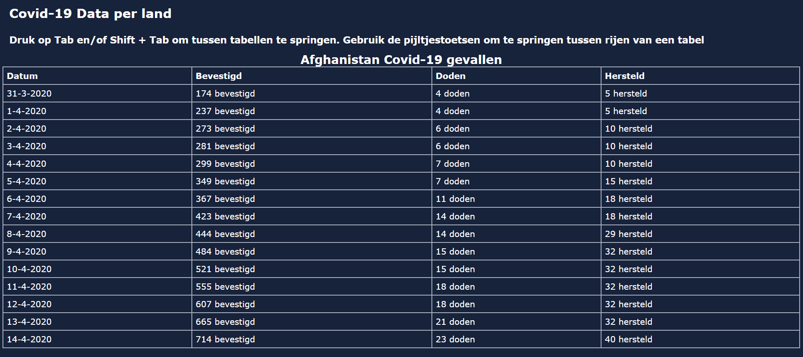
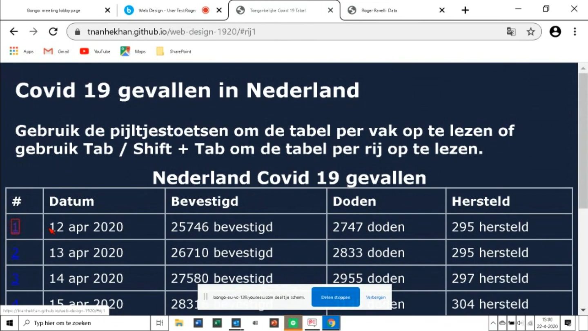
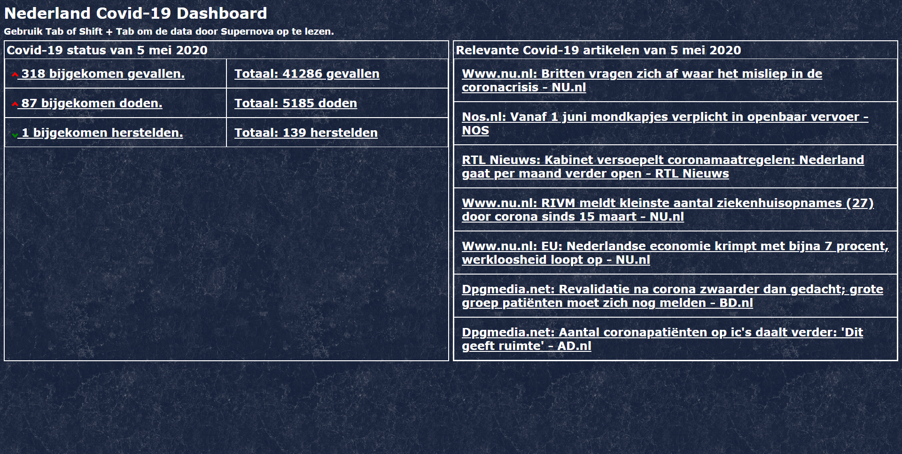

# Web Design @cmda-minor-web 1920
De persoon voor wie we deze opdracht maken is Roger Ravelli. Roger heeft maculadegeneratie en verliest steeds meer van zijn zicht. Voor zijn werk moest Roger veel technische tekeningen, spreedsheets en dergelijke lezen. Wegens de ontwikkeling van zijn aandoening heeft hij moeite gekregen om deze technische tekeningen en dergelijke af te lezen. 

Nu ligt aan ons de taak om een oplossing voor Roger te ontwerpen en te ontwikkelen zodat hij met zo min mogelijk moeite deze technische tekeningen, grafieken, tabellen of datavisualisaties kan zien.

## Inhoudsopgave
- [User Scenario](#user-scenario)
- [Exclusive Design](#exclusive-design)
- [Tests](#tests)
    - [Test 1](#test-1-08-04-2020)
    - [Test 2](#test-2-15-04-2020)
    - [Test 3](#test-3-22-04-2020)
- [Uiteindelijk Concept](#uiteindelijk-concept)
- [Conclusie](#conclusie)

## User Scenario
Boudewijn is 58 jaar en heeft jarenlang gewerkt als Bouwkundig Inspecteur. Voor zijn werk moest Boudewijn technische tekeningen, tabellen en grafieken aflezen. Maar door zijn aandoeningen begon hij zijn zicht kwijt te raken. Uit zijn rechteroog ziet 
Boudewijn tegenwoordig maar 2 procent. 

Boudewijn gebruikt tegenwoordig een screenreader om websites voor hem voor te lezen. Maar het is gebleken dat weinig websites screenreaders goed ondersteunen. Waaronder ook allerlei Covid-19 sites. 

Boudewijn wilt de huidige staat van Covid-19 in Nederland weten. Het is natuurlijk van levensbelang maar veel sites zijn nogal slecht toegankelijk met een screenreader. Hier moet er verandering aan komen.

## Exclusive Design
### Study Situation
Roger gebruikt tegenwoordig screenreaders omdat lezen hem veel energie kost. De screenreader die hij gebruikt maakt deel uit van de toegankelijkheidsoftware genaamd Supernova. Deze opdracht is speciaal voor gebruik samen met de Supernova screenreader gemaakt. 

Roger gebruikt Supernova op een Windows pc. De browser die hij gebruikt op zijn pc is Google Chrome. Qua mobiele apparaten heeft hij een iPhone 11 Pro met daarop Safari. 

### Ignore Conventions
Ik gebruikte bijvoorbeeld links (`<a>` tags) om elementen na te bootsen waardoor er doorheen getabd kan worden en waardoor deze elementen opgelezen kunnen worden door de screenreader. Niet echt de bedoeling van een link tag natuurlijk.

### Prioritise Identity
Roger is een beeldhouwer dus dacht ik om de achtergrond van de website een stenen textuur te geven. Hierdoor is de site toch iets persoonlijker voor Roger geworden.

### Add Nonsense
Ik heb bij de aria-labels van de links hier een daar willekeurige komma's en punten geplaatst. Hieruit blijkt dat de screenreader veel natuurlijker en menselijker klinkt dan zonder met de willekeurige interpunctie.

Afhankelijk van of de het aantal gevallen van covid-19 zegt de screenreader als het dalend is dat "het lekker gaat" en als het aantal gevallen stijgend is dat "het niet goed gaat".

## Tests
### Test 1 (08-04-2020)
Tijdens dit gesprek hebben we Roger een paar websites laten testen zodat we zijn gedrag op het web kunnen noteren. De site die wij hebben getest ging over de ontwikkeling van Covid-19. https://informationisbeautiful.net/visualizations/covid-19-coronavirus-infographic-datapack/ Hier is een korte samenvatting wat gebeurde tijdens de test:

>Begrijpt het in eerste instantie niet. “Spaghetti” Moeite om te navigeren van de covid spaghetti terug naar de bongo chat. Verward tussen tabs. Blijft vast op de covid. Weet niet hoe hij een tabblad sluit. Gebruikt chrome? Kent de shortcut niet om tab te sluiten? Weet zich wel “redelijk” te navigeren binnen 1 tab, maar meerdere tabs is een issue. Heeft een eizo monitor (ColorEdge?). Items op scherm lijken groot. Grote knoppen voor youtube maps en taskbar.
Heeft een rode muiscursor anders ziet hij de muis niet. Kan niet in een keer de gehele grafiek zien. Kan de assen lezen van de spaghetti covid grafiek. Ziet dat singapore en japan laag zijn? Screenreader zegt helemaal niks. Proberen op de iPad. Mail gestuurd en gebruikt siri voiceover om mail te vinden. Ziet wel dat de mail ontvangen op telefoon. Siri screenreader weet wel de covid spaghetti site af te lezen maar zegt alleen image dus niet bruikbaar. Vind tabellen makkelijker dan grafieken.

#### Bevindingen Test 1
- Gebruikt windows (supernova - meerdere functies o.a. braille regel) hele slechte ervaring
- fan van siri op ipad/Iphone als screenreader
- Goeie ervaring met dark-mode
- wilt graag contrasten/contouren zien
- Data moet consistent afgebeeld worden, dus niet in verschillende vormen
- Wilt wellicht iets met OCR zoals dedicon
- Text to speech van supernova vind hij heel vervelend en onmogelijk
- Spraak als ondersteuning, niet als uitgangs positie
- Wellicht gebruiken van RAW-Bestanden (veel pixels, extreem inzoomen), hele hoge resolutie

### Test 2 (15-04-2020)

Uit de eerste test is gebleken dat Roger zijn screenreader vaak gebruikt wanneer hij aan het browsen is op zijn desktop. Deze screenreader wordt echter vaak niet door websites ondersteund. De screenreader leest bijvoorbeeld de content van een site in een stuk door als een onverstaanbare warboel. Ik dacht dus eraan om iets met een screenreader en tabellen te doen.

Ik heb een tabel gemaakt met daarop de Covid-19 data van een land, in dit geval Afghanistan. Deze data heb ik in een tabel gestopt. Om door deze tabel te navigeren heb ik alle cellen een bepaalde tabindex gegeven zodat er door de cellen van de tabel heen gegaan kan worden. Naast een tabindex heb ik ook custom navigatie met behulp van de pijltjestoetsen geimplementeerd. 

Verder heb ik het design een donkere achtergrond gegeven omdat Roger een dark-mode prefereert tegenover light-mode. Verder heb ik de tekst van de tabel groot gemaakt en de tabel goed laten uitlijnen over het hele scherm zodat Roger het scherm goed kan lezen indien hij dat zou willen.

Mijn test bestond uit twee opdrachten voor Roger. Voor de eerste opdracht moest hij de data van een bepaalde cel uit de tabel voorlezen en de laatste opdracht moest hij een bepaalde cel met behulp van de screenreader laten voorlezen.

De eerste opdracht ging heel erg goed. Roger kon heel snel de data van een bepaalde cel uit de tabel voorlezen. Deze goede resultaten komt door een goede leesbaarheid van de tabel, wat Roger zelf ook aangaf. Het verschil qua contrast tussen de achtergrond en tekst maakte het hem makkelijk om data uit de tabel te lezen. Dit komt mede ook doordat de tabel zo goed uitgelijnd was en de tekst groot was. Mij is echter opgevallen dat de hele tabel niet zo goed in zicht was, Roger moest wat scrollen om de rest van de tabel te zien. Dit komt doordat Roger zijn scherm wat ingezoomd heeft staan. 

De tweede opdracht ging niet goed. Qua screenreader en navigatie implementatie werkte eigenlijk niks. Ten eerste werkte de tabindex en custom navigatie van pijltjestoetsen helemaal niet. Dit komt doordat Supernova alle standaard toetsenbord functionaliteit overneemt van de gebruiker. Wanneer de supernova screenreader aanstaat, wordt het hele toetsenbord gebruikt voor screenreader functionaliteit. Hierdoor kon de screenreader helemaal niks van de tabel voorlezen.  Dit is erg vervelend en maakt het erg moeilijk om navigatie met behulp van tabindex etc. te implementeren.
 Ik ga voor de volgende iteratie werken om de screenreader en navigatie werkend te krijgen.

### Test 3 (22-04-2020)

Deze test was een kortere test. Mijn focus lag deze week vooral op het werkend krijgen van navigatie in combinatie met de supernova screenreader.
 
 Ik heb een demo van de Supernova screenreader gedownload en ben ik uit gaan zoeken hoe deze screenreader werkt qua tabben en navigatie binnen in een website. Ik had Roger eerder zien tabben met de screenreader aan. Maar dit was zeker niet met tabindex, omdat tabindex dus niet werkte bij de vorige test. 
 
 Volgens [deze website](https://www.powermapper.com/tests/screen-readers/ua/ua-dolphin-ie/) blijkt dat tabindex met de supernova screenreader helemaal niet werkt. De enige elementen van een website waar naartoe getabd kan worden zijn blijkbaar interactieve elementen zoals links, buttons en input. Dit bracht mij dus op een idee.
 
 Met behulp van aria-labels en lege links die alleen een hashroute hebben heb ik een element gemaakt dat de data in de rij van een tabel opleest in een lopende zin. Deze elementen zijn te zien in de ``#`` kolom van de afbeelding hierboven. Op de oppervlakte geven deze links de rijnummer aan, maar deze zijn eigenlijk maar containers voor de aria-label wat de daadwerkelijke data voor de screenreader bevat.
 
 De data van de tabel heb ik ook veranderd naar die van Nederland, omdat dat toch wel dichter bij huis is dan Afghanistan.
 
 Net als Test 1 heb ik Roger twee opdrachten gegeven die hij moest uitvoeren. De eerste opdracht is dat hij zelf een bepaalde cel in de tabel moest oplezen en de tweede opdracht is dat deze cel door de screenreader opgelezen wordt.
 
 Zoals verwacht was de eerste opdracht net als vorige week succesvol. Ik had ook niks veranderd qua uiterlijk. Ik had alleen een extra kolom toegevoegd wat niets zou moeten uitmaken.
 
 De tweede opdracht ging goed. Mijn implementatie van de screenreader werkt goed. De screenreader las al de data van de rijen keurig op wanneer Roger op tab / shift + tab drukte.  Roger was ook positief over het resultaat en had zelf ook wat vragen over de technologie erachter zoals aria-label en dergelijke. Het enige wat niet goed ging was dat de browser niet gefocused was dus had de screenreader moeite met tabben, maar dit is helaas iets waar ik niks aan kan doen.
 
Nu ik weet hoe de screenreader werkt ga ik proberen om een soort dashboard te maken dat data over bijv. Covid-19 opleest met behulp van de Supernova screenreader. Deze data wordt dan getoond in tabellen.

## Uiteindelijk Concept

Mijn concept is uiteindelijk een dashboard voor Covid-19 geworden voor gebruik in combinatie met de supernova screenreader. De content die door de screenreader gelezen kan worden zijn allemaal links zoals uitgelegd in test 3.

Voor dit concept heb ik tabellen gemaakt met daarin Covid-19 data. In deze tabellen staat data van de huidige Covid-19 situatie in Nederland en staan er een aantal relevante nieuwsartikelen van vandaag erbij gelinkt. Deze artikelen komen van de [News API](https://newsapi.org/).

Het uiterlijk zoals de achtergrondkleur, uitlijning van de tabellen en grootte van het lettertype is gebaseerd op de bevindingen van test 2.

Verder heb ik de titel- en ondertitelbalk kleiner gemaakt zodat deze minder verticale ruimte van de site gebruikte. Hierdoor kan Roger het grootste gedeelte van de website zien zonder te hoeven scrollen. Ik heb ook een stenen achtergrond toegevoegd voor een beetje personaliteit, sinds Roger beeldhouwer is.

## Conclusie
Om eerlijk te zijn vond ik het testen nogal lastig. Ik ben geen designer dus weet ik niet echt hoe je het beste een design moet testen. Dat ik samen met iemand met een beperking moet testen is lastig en het feit dat dit remote moet maakt dit nog moeilijker. 

Ik wist bijvoorbeeld niet echt wat ik moest vragen aan Roger. Als ik iets test, kijk ik meer naar de handeling van de testpersoon dan wat de testpersoon zegt. Sinds het testen remote ging kon ik dus eigenlijk niet naar de handelingen van Roger kijken. Ik had op zich kunnen vragen dat hij hardop ging zeggen welke toetsen / toetsencombinaties hij bijv. indrukt. De Supernova screenreader die overschrijft alle standaard toetsencombinaties en je hebt dus niet echt de optie om je eigen toetsencombinaties te implementeren omdat er niet echt duidelijke documentatie is welke nou gebruikt wordt door Supernova.

Het is ook best belangrijk om je testpersoon op zijn gemak te stellen, hierdoor is de testpersoon wellicht spraakzamer en krijg je meer informatie. Dit kan worden bereikt door middel van een introductie of iets dergelijks, iets wat ik niet echt heb gedaan tijdens mijn tests. 

Dat Roger zijn scherm deelde was ontzettend handig voor het remote testen. Hierdoor kan je ook een beetje de handelingen van een testpersoon zien en hoe de testpersoon zijn computer gebruikt. Hierdoor ben ik bijv. erachter gekomen dat Roger zijn scherm wat heeft ingezoomd en dat Roger vaak dark-mode gebruikt.

Dit vak vond ik dus een unieke en eigenlijk ook een lastige ervaring. Ik denk te veel vanuit een developer oogpunt en toch minder van een designer oogpunt.

